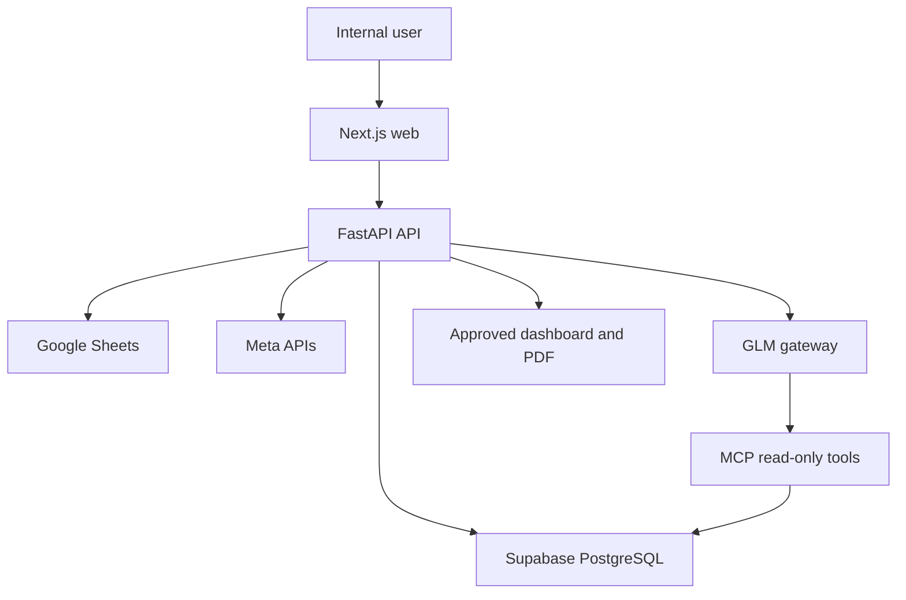

# Technical Requirements Document

## GrowthByte Standalone Client Reporting Platform

**Version:** 0.1  
**Status:** Draft for technical alignment  
**Date:** 31 July 2026  
**Product type:** New standalone project

---

## 1. Purpose

Build a new standalone reporting platform that combines:

- Meta Ads performance data
- Manually reviewed lead-quality data from Google Sheets
- Existing per-client knowledge currently modelled in PostgreSQL

The platform will calculate verified marketing and lead-quality metrics, then use a GLM-powered reporting agent to generate editable insights, recommendations, dashboards and client-ready PDF reports.

This project will not be implemented inside the current GrowthByte repository. The existing PostgreSQL structure will be audited and selectively reproduced as versioned Supabase migrations. The new application will not depend on the old application at runtime.

## 2. Core Product Boundary

The system follows this rule:

> Application code and SQL calculate the numbers. The agent explains the verified numbers.

The GLM agent must not independently calculate, estimate, repair or fabricate performance figures. Missing values must remain unavailable and uncertain matches must remain unmatched.

## 3. MVP Scope

### Included

- New independent web, API and MCP applications
- New Supabase project and PostgreSQL database
- Reused/adapted client-knowledge data structure
- Client-level authentication and data isolation
- Meta Ads connection and scheduled ingestion
- One configurable Google Sheet connection per client
- Spreadsheet, worksheet, column and status mapping
- Normalisation of Meta and Sheet data
- Campaign, ad-set and creative attribution where source fields permit it
- Lead-quality and period-comparison metrics
- Read-only MCP tools for the agent
- GLM-generated summary, wins, concerns and actions
- Human review, editing and approval
- Dashboard and client-ready PDF export
- Two-client pilot using different Sheet formats

### Excluded from MVP

- Google Ads, GA4, Search Console, SEO and organic reporting
- CRM integrations
- Social-media reporting outside Meta Ads
- Writing data back to Google Sheets
- Sales calling or lead follow-up
- Automatic campaign, targeting or budget changes
- Fully autonomous optimisation
- Runtime dependency on the existing GrowthByte application

## 4. Proposed Technology Stack

The new project will use the proven GrowthByte stack while remaining an independent codebase.

| Layer | Technology |
| --- | --- |
| Web | Next.js 15, React 18, TypeScript, Tailwind CSS, Radix UI, Lucide, Framer Motion |
| Data/forms | SWR, React Hook Form, Zod |
| Visualisation | Recharts; React Flow/Mermaid only where required |
| API | Python 3.11, FastAPI, Uvicorn, Pydantic |
| Agent runtime | Anthropic SDK / Claude Agent SDK through the GLM-compatible gateway |
| MCP | Python MCP SDK, FastAPI, Streamable HTTP |
| Database | Supabase PostgreSQL 17, Auth, RLS, Storage, migrations and realtime |
| Monorepo | Turborepo, pnpm workspaces and Poetry |
| Quality | Jest, jsdom, Pytest, pytest-asyncio, Ruff, ESLint and Prettier |
| Infrastructure | Docker, AWS EKS, ECR, Helm, ALB ingress and GitHub Actions |

## 5. High-Level Architecture



### Deployable services

1. `web`: dashboard, integration setup, mapping, report review and PDF access.
2. `api`: authentication enforcement, OAuth callbacks, ingestion, matching, metrics, agent orchestration and report lifecycle.
3. `mcp`: allowlisted, client-scoped, read-only tools used by the reporting agent.

A Kubernetes CronJob will call protected API job endpoints for scheduled synchronisation. This avoids duplicate in-process schedulers when the API runs multiple replicas.

## 6. Monorepo Structure

```text
growthbyte-reporting/
  apps/
    web/
    api/
    mcp/
  packages/
    ui/
    shared-types/
    report-schema/
    config/
  database/
    migrations/
    seed/
    policies/
  infrastructure/
    docker/
    helm/
    github-actions/
  docs/
```

The exact structure may be adjusted during scaffolding, but domain contracts and migrations must remain version-controlled.

## 7. Data Architecture

### 7.1 Existing database reuse

The old PostgreSQL database is a design and migration source, not a new runtime dependency.

Before development:

1. Export the existing schema without secrets.
2. Document tables, keys, indexes, constraints and RLS behaviour.
3. Identify the client and client-knowledge tables to reuse.
4. Remove legacy or unrelated application tables.
5. convert selected structures into clean, ordered Supabase migrations.
6. Validate migrated knowledge against at least two existing clients.

No production data will be copied until its scope, ownership and privacy requirements are approved.

### 7.2 Logical table groups

Final names should follow the audited source schema. The following logical groups are required.

| Group | Required records |
| --- | --- |
| Identity | users, clients, client memberships and roles |
| Knowledge | client profile, goals, KPIs, services, context, preferences and reporting rules |
| Integrations | connection metadata, encrypted credentials, selected accounts and connection state |
| Google Sheets | spreadsheet config, worksheet config, column mappings and status mappings |
| Meta | accounts, campaigns, ad sets, ads and daily performance facts |
| Leads | raw imported rows, normalised lead records, statuses and attribution fields |
| Matching | match result, method, confidence, reasons and unresolved records |
| Sync | sync run, source, cursor, counts, warnings, errors and timestamps |
| Metrics | frozen report-period snapshots and verified aggregates |
| Reports | report, generated draft, edits, versions, approval and export metadata |
| Audit | actor, action, entity, before/after metadata and timestamp |

### 7.3 Multi-tenant rules

- Every client-owned row must include `client_id`.
- RLS must deny access by default.
- A user may access a client only through an active membership.
- Background jobs must receive an explicit client scope.
- MCP tools must require a server-validated client context.
- Service-role access must remain backend-only.
- Integration tokens must be encrypted before database storage.
- Raw access tokens, phone numbers and lead notes must never appear in application logs.

## 8. Integration Requirements

### 8.1 Meta Ads

The new project needs its own Meta integration because it does not share the current application runtime.

Required capabilities:

- Connect or configure an authorised Meta account.
- Select the relevant ad account per client.
- Pull daily campaign, ad-set and ad-level insights.
- Store immutable source identifiers in addition to display names.
- Support incremental synchronisation and safe reprocessing.
- Track token expiry, permission failures, rate limits and partial syncs.
- Store client-specific tokens encrypted in the database, not in frontend storage.

An environment-level Meta token may be used only for local development or initial bootstrap. Production client connections should be stored per client.

### 8.2 Google Sheets

Required OAuth flow:

1. User opens a client.
2. User connects Google.
3. API validates OAuth state and stores the refresh token securely.
4. User selects a spreadsheet and worksheet.
5. API reads the header and sample rows.
6. User maps columns to canonical lead fields.
7. User maps source statuses to standard statuses.
8. User tests and saves the configuration.
9. User triggers the initial synchronisation.

MVP permissions should be read-only. The application must not edit the client’s Sheet.

### 8.3 Canonical lead fields

The mapping UI should support, where available:

- `source_lead_id`
- `lead_date`
- `lead_identifier`
- `campaign_id` and `campaign_name`
- `adset_id` and `adset_name`
- `ad_id` and `ad_name`
- UTM source, medium, campaign, content and term
- `lead_status`
- `is_qualified`
- `lead_stage`
- qualification or disqualification reason
- sales notes
- owner and follow-up status
- conversion status and revenue

Required fields depend on the configured report. If attribution fields are absent, the UI must warn that campaign or creative quality cannot be calculated reliably.

## 9. Ingestion and Normalisation

### 9.1 Source storage

- Store source rows with source identifiers, source timestamps and a deterministic row hash.
- Preserve sufficient raw JSON for debugging while restricting access to backend roles.
- Upsert normalised facts using stable source keys.
- Record every sync as succeeded, partially succeeded or failed.
- Make repeated syncs idempotent.

### 9.2 Synchronisation modes

- Manual refresh from the client dashboard
- Daily scheduled refresh through a Kubernetes CronJob
- Initial historical backfill for an approved date range
- Retry of failed runs with bounded backoff

### 9.3 Data-quality handling

The pipeline must continue safely when:

- OAuth permission is removed
- A Sheet or worksheet is renamed or deleted
- Mapped columns disappear
- Rows are incomplete or duplicated
- Meta tokens expire
- APIs return rate limits or partial responses
- Campaign names change

The system must show source-specific warnings and continue displaying any verified data that remains available.

## 10. Matching and Attribution Engine

### 10.1 Matching order

1. Exact platform/source lead ID
2. Exact ad ID, ad-set ID or campaign ID
3. Normalised UTM values
4. Normalised entity name plus compatible date/source
5. Unmatched

Every match must store its method and confidence. Approximate matches must not silently become verified matches.

### 10.2 Attribution limitation

Meta Ads insights are commonly aggregated, while Sheet rows may be individual leads. Campaign and creative lead-quality reporting is possible only when the Sheet provides compatible attribution fields or when authorised lead-level Meta data is available.

Therefore:

- Sheets containing only phone numbers and statuses cannot reliably attribute quality to a campaign.
- Name-only matching must be visibly lower-confidence than ID matching.
- Unmatched records remain visible and are excluded from attributed calculations.
- Client-level qualification metrics may still be calculated when campaign-level attribution is unavailable.

## 11. Metric Engine

All metrics must be calculated deterministically in SQL or Python and tested independently of the LLM.

| Metric | Calculation |
| --- | --- |
| Cost per lead | Meta spend / total Meta leads |
| Qualification rate | qualified reviewed leads / reviewed leads x 100 |
| Cost per qualified lead | attributed spend / attributed qualified leads |
| Invalid rate | invalid reviewed leads / reviewed leads x 100 |
| Conversion rate | converted reviewed leads / reviewed leads x 100 |
| Review coverage | reviewed leads / imported leads x 100 |

Rules:

- Zero denominators return `null`, not zero or infinity.
- Missing inputs return `Not Available` in the UI.
- Currency and timezone are client-configurable.
- Period comparison uses equivalent date windows.
- Every generated report references a frozen metric snapshot.
- Regenerating narrative must not mutate the snapshot.

## 12. MCP and Agent Design

### 12.1 Agent responsibilities

The agent may:

- Explain verified performance.
- Compare current and previous periods.
- Compare performance with client KPIs.
- Identify wins, concerns and data-quality gaps.
- Recommend human-reviewed next actions.

The agent may not:

- Create missing numbers.
- Recalculate source metrics.
- access a client outside the current scope.
- Change campaigns, budgets, Sheet rows or source data.
- Publish a report without human approval.

### 12.2 Initial MCP tools

- `get_client_context(client_id)`
- `get_client_kpis(client_id, period)`
- `get_verified_summary(client_id, snapshot_id)`
- `get_campaign_quality(client_id, snapshot_id)`
- `get_adset_quality(client_id, snapshot_id)`
- `get_creative_quality(client_id, snapshot_id)`
- `get_period_comparison(client_id, snapshot_id)`
- `get_data_quality(client_id, snapshot_id)`

Tools are read-only and return structured JSON. Tool responses should exclude unnecessary PII and raw credentials.

### 12.3 Agent output contract

The GLM response must validate against a Pydantic schema containing:

- `executive_summary`
- `wins[]`
- `concerns[]`
- `recommended_actions[]`
- `data_quality_notes[]`
- evidence references for each material claim
- model and generation metadata

Invalid structured output should be retried within a fixed limit and then marked as failed for human handling.

## 13. API Surface

Proposed API groups:

| Group | Example responsibility |
| --- | --- |
| `/api/v1/clients` | client access and reporting configuration |
| `/api/v1/knowledge` | client knowledge and KPI management |
| `/api/v1/integrations/meta` | connect, select account, status and sync |
| `/api/v1/integrations/google` | OAuth, spreadsheet selection and status |
| `/api/v1/sheet-configs` | worksheet, column and status mapping |
| `/api/v1/sync-runs` | manual sync, history, warnings and failures |
| `/api/v1/data-quality` | unmatched, duplicate and missing records |
| `/api/v1/metrics` | verified snapshot-backed aggregates |
| `/api/v1/reports` | create draft, regenerate, edit, approve and export |
| `/internal/jobs` | protected scheduler endpoints |

All client routes must validate membership server-side. Client IDs received from the browser are untrusted input.

## 14. Web Application Requirements

### Main screens

1. Login and authorised client selection
2. Client knowledge and KPI setup
3. Meta connection and sync status
4. Google connection, Sheet selection and mapping wizard
5. Data-quality and unmatched-record review
6. Reporting-period dashboard
7. Agent draft editor and approval workflow
8. Report history and PDF download

### Dashboard sections

- Client goal and KPI targets
- Spend and lead overview
- Reviewed, qualified, invalid, disqualified and converted leads
- Campaign, ad-set and creative quality
- Period-over-period comparison
- Agent summary, wins, concerns and actions
- Sync health and data-quality warnings

## 15. Report Lifecycle

Report state machine:

`draft -> generated -> under_review -> approved -> exported`

Additional terminal state: `generation_failed`.

Requirements:

- Only verified snapshots can produce reports.
- Generated text remains editable by authorised internal users.
- Edits create versions or an audit trail.
- Approval records the user and timestamp.
- PDF generation uses only the approved version.
- Approved reports cannot silently change when source data later syncs.
- A new snapshot and report version are required for refreshed data.

PDFs will be stored in a private Supabase Storage bucket and accessed through authorised or short-lived signed requests.

## 16. Security Requirements

- Do not commit `.env` files or secrets.
- Use separate secrets for development, staging and production.
- Store OAuth refresh tokens and Meta tokens encrypted at the application layer.
- Keep Supabase service-role credentials backend-only.
- Validate OAuth state and redirect URIs.
- Apply least-privilege API scopes.
- Enforce RLS plus server-side client membership checks.
- Protect internal CronJob endpoints with service authentication.
- Redact credentials and lead PII from logs, traces and model prompts.
- Record report generation, edits, approvals and downloads in audit logs.
- Apply retention and deletion policies to raw lead data.

## 17. Observability and Operations

Minimum operational signals:

- API and MCP health endpoints
- Sync success/failure and record counts
- Integration token/permission failures
- API rate-limit events
- Unmatched and duplicate rates
- Metric snapshot generation failures
- Agent latency, token use and validation failures
- PDF generation failures
- Request correlation IDs

Logs must be structured and must not contain credentials or unnecessary PII.

## 18. Testing Strategy

### Unit tests

- Column and status mapping
- Normalisation
- Matching priority and confidence
- Metric calculations and zero/missing inputs
- Agent output schema validation
- Permission helpers

### Integration tests

- Google OAuth callback and Sheet reads using mocks
- Meta pagination, rate-limit and partial-response handling
- Supabase RLS and cross-client denial
- MCP tool client scoping
- Report snapshot and approval lifecycle

### End-to-end tests

- Connect Client A with one Sheet format.
- Connect Client B with a different Sheet and status format.
- Sync Meta and Sheet data.
- Review unmatched records.
- Generate, edit, approve and download a report.
- Prove that no Client A user or agent request can access Client B data.

## 19. Delivery Phases

### Phase 0: Discovery and contract freeze

**Work**

- Audit the existing PostgreSQL schema and knowledge tables.
- Inspect two real client Sheet formats and expected Meta account structure.
- Confirm canonical lead fields, statuses, KPIs, currency and timezone rules.
- Validate available Meta attribution fields and access permissions.
- Freeze MVP scope and data contracts.

**Exit criteria**

- Approved source-to-target schema map
- Approved field/status mapping contract
- Confirmed attribution feasibility for two pilot clients
- No unresolved blocker around source access

### Phase 1: Repository and platform foundation

**Work**

- Scaffold the Turborepo with `web`, `api` and `mcp`.
- Configure pnpm, Poetry, linting, formatting and tests.
- Create development Docker configuration.
- Create Supabase development project and migration workflow.
- Add CI checks and environment validation.

**Exit criteria**

- All three services run locally
- CI passes
- Supabase migration can be applied from an empty database

### Phase 2: Database, authentication and knowledge

**Work**

- Port/adapt approved client and knowledge tables.
- Add memberships, roles, integration, sync, lead, metric and report tables.
- Implement indexes, constraints, audit fields and RLS.
- Build client knowledge and KPI API/UI.
- Load controlled pilot-client knowledge.

**Exit criteria**

- Users can access only assigned clients
- Two pilot clients have validated knowledge records
- Cross-client RLS tests pass

### Phase 3: Meta and Google Sheets connectors

**Work**

- Implement Meta account configuration and ingestion.
- Implement Google OAuth and encrypted token storage.
- Build spreadsheet/worksheet selection.
- Build column and status mapping wizard.
- Add test-connection, manual sync and sync-history UI.

**Exit criteria**

- Both pilot clients can connect their sources
- Sample data is imported without hardcoded Sheet columns
- Errors are visible and recoverable

### Phase 4: Normalisation, matching and metrics

**Work**

- Build idempotent raw and normalised ingestion.
- Implement deterministic matching and confidence storage.
- Build unmatched/duplicate review views.
- Implement tested metric calculations and frozen snapshots.
- Add previous-period and KPI comparison.

**Exit criteria**

- Verified metrics reconcile with manual calculations
- No uncertain record is silently attributed
- Snapshot regeneration is deterministic for identical inputs

### Phase 5: MCP and GLM reporting agent

**Work**

- Implement read-only, client-scoped MCP tools.
- Connect the GLM gateway through the Anthropic-compatible SDK.
- Build the Pydantic output contract and evidence references.
- Add retry, timeout, failure and audit handling.
- Ensure prompts omit unnecessary PII.

**Exit criteria**

- Agent produces schema-valid analysis from verified snapshots
- Every numeric claim is traceable to tool data
- Agent cannot query another client or mutate source data

### Phase 6: Dashboard, human review and PDF

**Work**

- Build KPI cards, charts, tables and data-quality sections.
- Add report editing, versioning and approval.
- Generate branded PDFs from approved versions.
- Store exports privately and add authorised downloads.

**Exit criteria**

- An account manager can complete the full report workflow
- Dashboard and PDF show the same snapshot and approved narrative
- Unapproved content cannot be exported as final

### Phase 7: Hardening, deployment and pilot

**Work**

- Complete automated and manual QA.
- Configure ECR, EKS, Helm, ALB and GitHub Actions.
- Add Kubernetes CronJobs and production secrets.
- Run security, RLS, backup and restore checks.
- Pilot with two clients and record reconciliation results.

**Exit criteria**

- Production deployment is healthy
- Daily sync and alerting operate correctly
- Two differently structured clients run without custom code
- Product acceptance criteria are signed off

## 20. MVP Acceptance Criteria

The MVP is complete when:

- The new application operates independently of the old project.
- Existing client knowledge is represented correctly in the new database.
- Two clients can connect different Google Sheet structures through configuration.
- Meta and Sheet data sync without manual copying.
- Verified campaign and creative quality are shown when attribution data exists.
- Missing attribution is clearly reported rather than guessed.
- CPL, CPQL, qualification rate and related metrics reconcile with manual checks.
- The GLM agent produces structured, evidence-backed analysis.
- An internal user can edit and approve the analysis.
- A client-ready PDF can be generated from the approved version.
- RLS and application checks prevent cross-client access.
- No secrets or unnecessary PII are exposed to the browser, logs or agent.

## 21. Decisions Required During Phase 0

1. Which exact existing knowledge tables and fields will be reused?
2. Will existing client knowledge data be migrated once, or entered afresh?
3. Which two clients and Sheets will be used for the pilot?
4. Do their Sheets contain IDs/UTMs sufficient for campaign and creative attribution?
5. Will Meta use per-client OAuth connections or an approved system-user model?
6. What are the canonical lead statuses and reviewed-lead definition?
7. Which currencies, timezones and reporting comparison rules are required?
8. Which users may edit, approve and download final reports?

## 22. Environment Configuration

The accompanying `.env.example` lists the required configuration groups for local development and deployment. Real values must be stored in local uncommitted `.env` files, CI secrets and Kubernetes Secrets.

