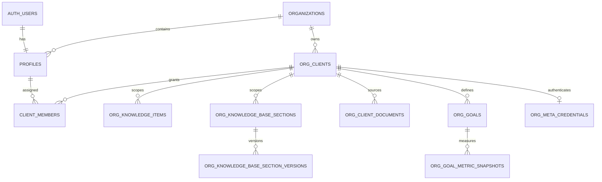

# Source schema inventory

Status: **migration-derived; live database not verified**  
Source reviewed read-only: `D:\growthbyte\seobyte\SEOByte` at observed commit `27c9d7f35ca9f8936adc5ec1befde49c172f6882` plus pre-existing working-tree changes.  
Evidence: Supabase migrations through `20260729150000_org_meta_credentials.sql`, selected Pydantic models, Meta sync modules, and reporting queries.

The legacy repository contains no canonical schema dump and no database connection was supplied. This document therefore describes the intended schema produced by the available migrations; it cannot prove which migrations or manual changes exist in a live database.

## Relevant tables

| Existing table | Important observed columns | Keys, relationships, indexes, and constraints | Observed RLS posture |
|---|---|---|---|
| `organizations` | `id uuid`, `name text`, `settings jsonb`, timestamps | PK `id`; tenant root | RLS enabled; no relevant user policy found in reviewed migrations |
| `org_clients` | `id`, `organization_id`, `name`, `description`, `domain`, `location`, `industry`, `tier`, `settings jsonb`, `created_by`, `is_demo`, timestamps | PK; FK `organization_id -> organizations`; indexes on organization and updated time | `client_portal_read`: internal team or membership by client id |
| `profiles` | `id`, `email`, `full_name`, `avatar_url`, `role`, `status`, `sessions_revoked_at`, `organization_id`, timestamps | PK/FK `id -> auth.users`; FK organization; role/status checks; indexes on role and organization | self/staff read, self/admin update, token-hook read; exact policy interaction needs live verification |
| `client_members` | `id`, `profile_id`, `client_id`, `member_role`, `created_at` | PK; FKs to profiles/clients; unique `(profile_id, client_id)`; indexes on each FK | own membership or team read; auth hook can read |
| `staff_client_allowlist` | `profile_id`, `client_id`, `created_at` | composite PK and FKs to profiles/clients | admins read; enforcement is described as server-side, not an RLS basis for all data |
| `org_projects` | `id`, `organization_id`, nullable `client_id`, `name`, `description`, `tags`, timestamps | PK; org/client FKs; indexes on org/client/updated | RLS enabled; no table policy found in reviewed migrations |
| `org_knowledge_items` | `id`, `organization_id`, nullable `client_id`, `title`, `content`, `content_type`, `tags`, timestamps | PK; org/client FKs; indexes on org/client/updated | RLS enabled; no table policy found in reviewed migrations |
| `org_knowledge_base_sections` | `id`, `client_id`, `section_number`, `section_key`, `title`, `content`, `structured_data`, `approvals`, `version`, completion/gap fields, review/change attribution, timestamps | PK; FK client; FK `changed_by -> profiles`; indexes on client/updated/changed_by; update trigger creates history | RLS enabled; no direct client policy found in reviewed migrations |
| `org_knowledge_base_section_versions` | snapshot of section content/structure/approvals plus version and change attribution | PK; FK section (cascade), FK changed_by; unique `(section_id, version)`; indexes by section/client/changed_by | broad `authenticated` SELECT, not client-isolated |
| `org_client_documents` | `id`, `client_id`, name/path/MIME/size/char count, extracted `content`, created time | PK; FK client; index `(client_id, created_at desc)` | broad `authenticated` SELECT; storage bucket also broad authenticated read |
| `kb_field_comments` | org/client ids, text `section_id`, `field_key`, author fields, body, attachments, created time | PK; lookup index `(client_id, section_id)`; declared ids lack FKs in migration | broad authenticated read; author-only insert/delete, without membership check |
| `kb_thread_status` | `client_id`, text `section_id`, `field_key`, `resolved`, `updated_at` | composite PK; no FKs declared | broad authenticated read/insert/update |
| `org_goals` | org/client ids, hierarchy, goal/KPI text, dates, metric name/unit/baseline/target/current/source/window/accumulate, integration ref, status, risk, rollup weight | PK; org/client/self FKs; indexes on org/client/parent/updated; status/source checks and cycle guard | client portal read by team or membership |
| `org_goal_metric_snapshots` | `id`, `goal_id`, `value`, `source`, `notes`, `captured_at` | PK; FK goal (cascade); index `(goal_id, captured_at desc)` | RLS enabled with no reviewed user policy: effectively service-role only |
| `ads_daily` | `account_key`, `date`, campaign id/name, spend, delivery metrics, conversions/value, leads, `qualified_leads`, `raw_actions` | composite PK `(account_key,date,campaign_id)`; account/date index | any authenticated user can read every account |
| `ads_platform_daily` | same campaign/day metrics plus publisher platform/position | composite PK including account/date/campaign/platform/position; account/date and platform indexes | any authenticated user can read every account |
| `ads_audience_daily` | account/day/age/gender plus spend/delivery/conversion/lead metrics | composite PK `(account_key,date,age,gender)`; account/date index | any authenticated user can read every account |
| `ads_targeting` | account, ad-set/campaign ids, names/status, age/gender/geo/interests/custom audiences | PK `(account_key,adset_id)`; campaign index | any authenticated user can read every account |
| `leads` | Meta message/comment `id`, optional phone, user/name/message, source, legacy account/platform, URL/time, notes and CRM tracking fields | PK `id`; checks for fixed sources/accounts/platforms; time/account indexes | staff-only read after hardening, but no `client_id`; broad authenticated update policy remains in migrations and needs live review |
| `sync_log` | serial id, start/finish, source, `account_key`, status, row count, message | PK; source/account index | any authenticated user can read every account |
| `job_runs` | job/client/date/status/error/metrics | PK; nullable FK client; unique `(job_name,client_id,run_date)`; index name/date | team read |
| `org_google_integrations` | org/client, Google account, encrypted tokens (legacy), scopes, GSC/GA4 selections, blog filter/type, timestamps | PK; org/client FKs; unique `(organization_id,client_id)`; indexes | RLS enabled; no user policy found |
| `org_google_credentials` | org, account email, encrypted refresh/access token, expiry/scopes, timestamps | PK; FK organization; unique organization | RLS enabled; no user policy found; service-side intent |
| `org_meta_credentials` | org/client, encrypted access token, timestamps | PK; org/client FKs; unique `(organization_id,client_id)`; client index | RLS enabled with no user policy; intentionally service-role only |
| `audit_client_access` | actor, accessed client, type, time, metadata | PK; profile/client FKs; client/time index | admins read; service writes |
| `auth_events` | event/actor/target/workspace, network/user-agent metadata, time | PK; indexes on time/actor/type; no FKs declared | admins read; service writes |

Other workflow, task, blog/SEO, Instagram, execution, invitation, comment, and cache tables exist, but they are outside the minimum reporting/knowledge migration scope. They must not be copied wholesale.

## Relationships and isolation

The legacy system evolved from `GROWTHBYTE_ORG_ID` single-tenancy toward organization/profile membership. Normal client entities use `client_id`, while Meta reporting uses `org_clients.settings.meta_account_key -> ads*.account_key`, and leads use a fixed `account` code. The reviewed migration explicitly notes a value mismatch (`leads.account` includes `franchise`, while client settings used `silpa`/`superk`). These indirect mappings are not acceptable as the target isolation boundary.

## Knowledge findings

- Two overlapping knowledge representations exist: free-form `org_knowledge_items` and structured/versioned `org_knowledge_base_sections`.
- Sections support JSON structure, field approvals, completion/gap state, and append-only prior-version snapshots.
- Source documents store extracted content and private storage paths, but reviewed policies allow all authenticated users to read across clients.
- Field comments/status use text section identifiers without declared FKs and broad policies.
- Migration scope (free-form items, structured sections, documents, history, approvals/comments) is not confirmed.

## KPI/reporting findings

- `org_goals` contains KPI text plus metric baseline/target/current and source metadata; snapshots provide a reusable time-series pattern.
- Legacy Meta performance is campaign/day level. It does not persist normalized campaign, ad-set, or ad entities, and it has no ad-level daily performance table.
- `qualified_leads` is explicitly written as `0` by the Meta sync because Meta Insights does not expose the business qualification outcome.
- Legacy action parsing treats several Meta action types as leads and purchase types as conversions; business semantics still require confirmation.
- Existing derived CPL/CPQL are computed in TypeScript, which conflicts with the new requirement that verified metrics be calculated in SQL or Python.

## Reuse, adapt, and exclude assessment

- **Reuse as concepts:** UUID identifiers, client membership, structured knowledge with history/approval, goal/KPI model, immutable metric snapshots, and audit events.
- **Adapt:** clients, memberships/roles, knowledge, goals, Meta performance, sync logs, and credentials. All client-owned records need explicit `client_id` and deny-by-default RLS.
- **Split:** integration configuration from encrypted secrets; raw Sheet rows from normalized leads; Meta entities from daily facts; report version from approval events.
- **Exclude:** fixed `silpa`/`superk` account enums, indirect `settings.meta_account_key` isolation, broad authenticated read/update policies, legacy workflow/content/SEO/Instagram tables, application-specific agent/execution tables, and environment-pinned organization selection.

## Verification gaps

- Live tables, extensions, indexes, triggers, constraints, grants, policies, storage policies, row counts, and migration application order are unverified.
- Pre-existing working-tree changes include Meta-related code/migration files; this audit records what was readable, not what is deployed.
- No old PostgreSQL connection or export was available.

